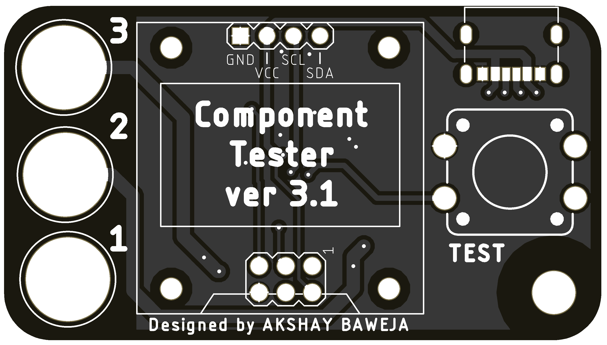
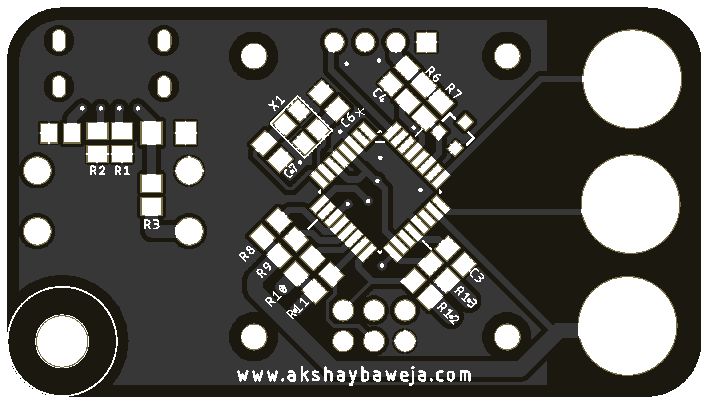
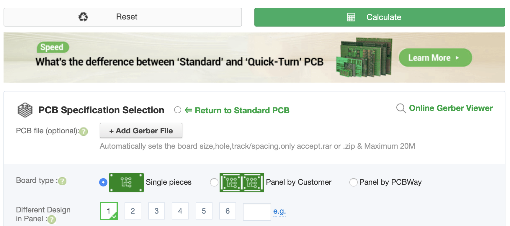
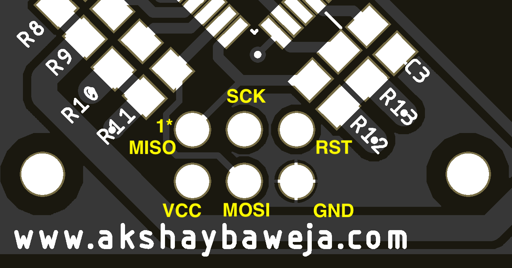

# Component Tester OLED (Keychain) <a href="https://www.tindie.com/stores/akshaybaweja/?ref=offsite_badges&utm_source=sellers_akshaybaweja&utm_medium=badges&utm_campaign=badge_small"></a>




## Sending PCBs for fabrication

1. Download the [Gerber Files](GERBER_FILES.zip)
2. Goto [PCBWAY](https://www.pcbway.com/QuickOrderOnline.aspx) for sending files for fabrication
3. Upload **GERBER_FILES.zip** using the **+Add Gerber File** option

4. Select Quantity of PCBs
5. Select your desired *soldermask color*.
6. Select your shipping method on thr right
7. Click **Save to Cart** and **Checkout**

## Bill of Materials
|Qty|Designator|Package|Value|Description|MANUFACTURER PART NUMBER|
|---|----------|-------|-----|-----------|------------------------|
|1|C2|0805|100nF|CAP CER 0805 0.1UF 100V X7R|C0805C104K1RECAUTO|
|1|C3|0805|1nF|CAP CER 1000PF 50V C0G/NP0 0805|C0805C102J5GACTU|
|1|C4|0805|10nF|CAP CER 0805 10NF 100V X7R|C0805X103K1RAC3316|
|1|C5|1206|10uF|CAP CER 10UF 25V X5R 1206|C1206C106M3PACTU|
|2|C6, C7|0805|22pF|CAP CER 22PF 50V C0G/NP0 0805|C0805C220J5GACTU|
|2|R1, R2|0805|5.1kΩ|RES 5.1K OHM 5% 1/4W 0805|RK73B2ATTD512J|
|1|R3|0805|27kΩ|RES SMD 27K OHM 1% 1/8W 0805|CRG0805F27K|
|1|R6|0805|10kΩ|RES 10K OHM 1% 1/4W 0805|RNCP0805FTD10K0|
|1|R7|0805|3.3kΩ|RES 3K3 OHM 1% 0805|CRGCQ0805F3K3|
|3|R8, R10, R12|0805|680Ω|RES SMD 680 OHM **0.1%** 1/4W 0805|ERJ-PB6B6800V|
|3|R9, R11, R12|0805|470kΩ|RES SMD 470K OHM **0.1%** 1/4W 0805|ERJ-PB6B4703V
|1|U1|TQFP32|ATMEGA328P-AU|IC MCU 8BIT 32KB FLASH 32TQFP|ATMEGA328P-AUR
|1|U2|SOT23-3|LM4040|IC VREF SHUNT 2% SOT23-3|LM4040EIM3X-2.5/NOPB
|1|X1|TSX-3225|16MHz|CRYSTAL 16.00 MHZ 9PF SMD|TSX-3225 16.0000MF09Z-AC0|
|1|J1|CUI_UJC-HP-3-SMT-TR|USB C (Power Only)|USB JACK, C TYPE, POWER ONLY, 6|UJC-HP-3-SMT-TR
|1|TEST|12MM PTH TACTILE SWITCH|-|SWITCH TACTILE SPST-NO 0.05A 12V|PTS125SM43-2 LFS|
|1|DISPLAY|-|-|OLED 0.96" 4 PIN I2C Interface|[Amazon](https://www.amazon.com/dp/B06XRBYJR8)|
|3|1, 2, 3|2MM BANANA JACK FEMALE|-|-|[Amazon](https://www.amazon.com/Tegg-Banana-Binding-Terminal-Connector/dp/B07GSLPCBV/)|

## Uploading Firmware

### Hardware Setup 

Using a USBasp programmer connect it to the ICSP Header on the board. Refer the following pinout for connections -


> PCB Bottom Side

### Software Installation

>**NOTE:** AVRDUDE must be installed in your computer in order for the following instructions to work.

Open Terminal/ Command Prompt in your system, navigate to folder's location with above files and run the following commands -

#### Uploading the .HEX file and .EEP file to MCU

```
avrdude -c usbasp -B 20  -p m328p -P usb -U flash:w:./TransistorTester.hex:a -U eeprom:w:./TransistorTester.eep:a
```

#### Setting the FUSES

```
avrdude -c usbasp -B 200  -p m328p -P usb  -U lfuse:w:0xe2:m -U hfuse:w:0xd9:m -U efuse:w:0xfc:m
```

---

### References
- [Schematic](./Schematic.pdf)
- [Original Transistor Tester](https://www.mikrocontroller.net/articles/AVR_Transistortester)
